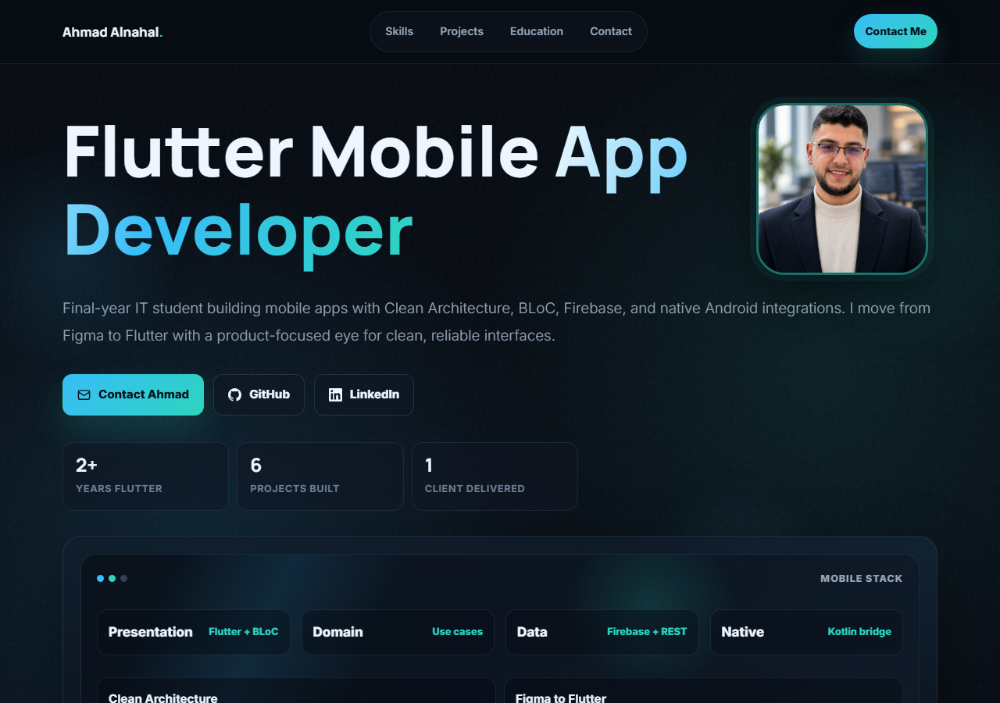

# Ahmad Alnahal — Portfolio

Personal portfolio site for **Ahmad Alnahal**, a Flutter mobile developer and final-year IT student.

**Live site:** https://ahmad-alnahal.github.io



## About

A single-page portfolio built to show real, shipped work rather than a generic template: production and client projects (with in-page screenshot galleries for the ones whose code is private), skills, education, and a way to get in touch or grab a CV — all in one fast-loading page.

## Tech

No framework, no build step — one `index.html` with inline CSS and vanilla JavaScript:

- Plain HTML5 + CSS3 (custom properties, CSS Grid/Flexbox, `prefers-reduced-motion` support)
- Vanilla JS: scroll-based reveal animations, a scrollspy nav, and a custom lightbox/gallery component (phone and browser mockup frames) with no external libraries
- Hosted on GitHub Pages

## Features

- Dark, glassmorphism-style UI with a consistent color system
- Project case studies, including private/client work shown via screenshots instead of source code
- A lightbox gallery for project screenshots, rendered inside phone or browser mockup frames depending on the project
- Fully responsive, down to small mobile widths
- Open Graph / Twitter Card metadata so shared links render a proper preview

## Structure

```
index.html          Entire site: markup, styles, and script
assets/              Images (project screenshots, CV, favicon, profile photo)
```

## Contact

- Email: alnahal2003@gmail.com
- LinkedIn: [ahmadalnahal](https://www.linkedin.com/in/ahmadalnahal/)
- GitHub: [@Ahmad-alnahal](https://github.com/Ahmad-alnahal)
